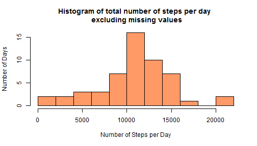

## Loading and preprocessing the data

```r
library(dplyr)  
library(ggplot2)  
data<-read.csv("activity.csv", header = TRUE)  
#Aggregate the total steps for each day

ag.tot<-aggregate(data$steps, by=list(data$date), FUN=sum)
ag.tot[,2]<-as.numeric(ag.tot$x)
```
## What is mean total number of steps taken per day?
This calculation is prior to  imputation.

```r
hist(ag.tot$x, breaks = 15, main = "Histogram of total number of steps per day \n excluding missing values", xlab = "Number of Steps per Day", col = "#FF9966", ylab = "Number of Days")
```

 

```r
Mean<-mean(ag.tot$x, na.rm=TRUE)
Median<-median(ag.tot$x, na.rm = TRUE)
options(scipen = 3, digits = 2)
```
Mean total number of steps per day (pre-imputation): **10766.19**    
Median total number of steps per day(pre-imputation): **10765**  


## What is the average daily activity pattern?


## Imputing missing values


## Are there differences in activity patterns between weekdays and weekends?
